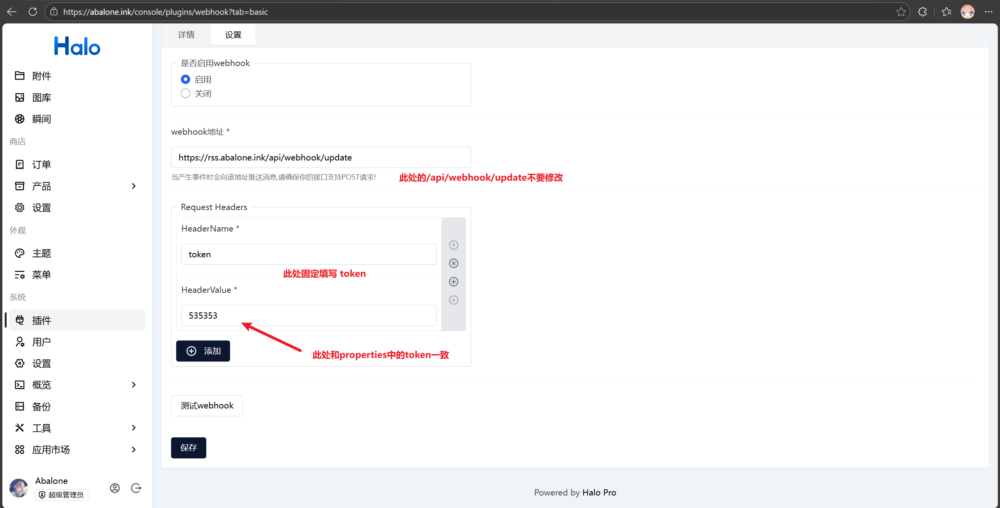

## 基于Halo WebHook插件和RSS插件的微信公众号草稿自动推送工具
*注：由于微信公众号的发布api需要企业主体认证，故没有实现发布相关的推送，只能自动或手动推送文章到草稿箱，然后再手动发布*
- 具体实现功能：
- 新增文章时一键推送至公众号草稿箱
- 提供接口将已发布文章推送至公众号草稿箱

## 环境依赖

- 建议使用 java 21
- redis
- [Halo 本体](https://docs.halo.run/category/安装指南/)
- [Halo 插件 webhook](https://github.com/wxyShine/plugin-webhook)
- Halo 插件 rss

## 快速使用

- release中获取jar包，直接运行jar包启动服务端
- 确保在halo上有安装webhook插件和rss插件
- 在webhook插件中，配置如下图
  - 


API:
- `/api/post/addDraft`: 接收两个参数:token和title，将已发布的文章推送至草稿箱，title为文章标题。
  - 该方法基于rss实现，因此请确保推送的文章正确的显示在了rss里

```
不强制刷新获取Token
    curl https://api.weixin.qq.com/cgi-bin/stable_token \
    -H "Content-Type: application/json" \
    -d '{
    "grant_type": "client_credential",
    "appid": "xxxxx",
    "secret": "xxxxx"
    }'
```

application.properties

```properties
server.port=3001
spring.application.name=AbaloneRSS
spring.data.redis.host=localhost
spring.data.redis.port=6379
spring.data.redis.password=redis密码
spring.data.redis.database=0
spring.data.redis.timeout=5000ms

rss.uri=halo rss完整地址，如：https://abalone.ink/rss.xml

halo.uri=halo完整地址如：https://abalone.ink/
#Blog original attachment storage host
halo.blog-attachment-host=halo附件储存域名，如：cdn.abalone.ink
halo.file-path=由于需要先下载图片再上传，所以这里是halo上素材下载后的储存地址，如：/ubuntu/home/rss/resource
halo.token=在halo的webhook插件里配置的token 如535353，abcdef

wx.appname=你的微信公众号名
wx.appid=微信appid
wx.appsecret=微信appsecret
```

